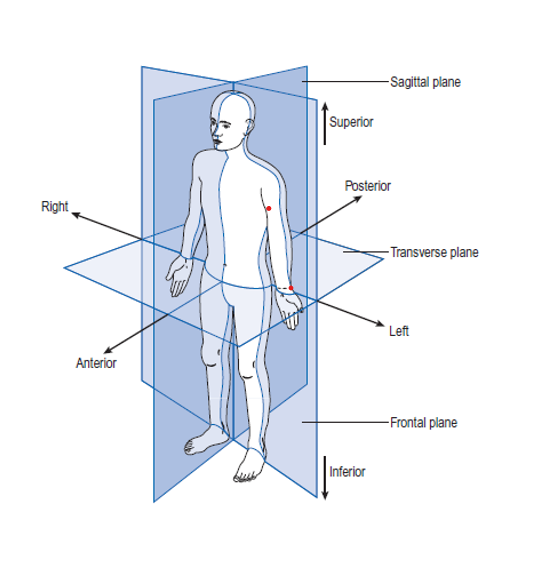
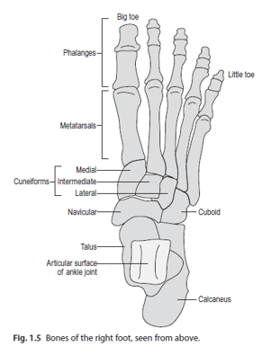

# OpenPose for 2D Gait Analysis: Knee Flexion Landmark Detection 

Gait analysis is the scientific study of walking patterns in the field of biomechanics. It involves analyzing body mechanics, such as joint angles and muscle activity, during the different phases of walking. This analysis helps in diagnosing mobility issues, optimizing athletic performance, and guiding rehabilitation therapies.
It is crucial in various medical fields, especially orthopedics and rehabilitation.  Traditional approaches are not accessible and require costly and obtrusive equipment. 

We designed a markerless, low monetary cost, accessible approach to human gait analysis using an OpenPose-based 2D estimation system for knee flexion landmarks. Next, we plot Clinical gait angles, points of contact, and errors in estimation via approximations in displacement and flexion angles by taking a weighted average tuned to a specific demographic. 
Our approach could aid in the early detection and management of Gait anomalies often linked to people with musculoskeletal disability, providing an accessible diagnosis.

## OpenPose Installation and Usage Guide 

This README provides detailed instructions for setting up and using OpenPose, an open-source real-time multi-person keypoint detection library for body, face, and hand estimation. The guidelines are based on version 1.7.0 of OpenPose.

## Downloading Models

If you don't have the `models` directory:

1. **Clone the OpenPose Repository:**
   - First, clone the OpenPose repository from GitHub to your local machine. Use the following command:
     ```
     git clone https://github.com/CMU-Perceptual-Computing-Lab/openpose.git
     ```
   - This will create an OpenPose directory with all the necessary files, including the `models` directory.

2. **Base Models:**
   - After cloning, navigate to the `models` directory within the OpenPose folder.
   - Double-click on `getBaseModels.bat`. This script will download the required body, face, and hand models.

3. **Optional Models:**
   - For additional models like COCO and MPII, double-click on `models/getCOCO_and_MPII_optional.bat`. Note: These models are slower and less accurate. Download them only if necessary.

## Installation Steps

- Ensure that you have cloned or downloaded the OpenPose repository from GitHub. For detailed instructions, refer to the following resources:
    - OpenPose v1.7.0: [OpenPose GitHub - v1.7.0](https://github.com/CMU-Perceptual-Computing-Lab/openpose/tree/v1.7.0)
    - Documentation: [OpenPose Documentation - v1.7.0](https://github.com/CMU-Perceptual-Computing-Lab/openpose/blob/v1.7.0/doc/)

## Quick Start Guides

1. **Python Quick Start:**
   - For Python usage, refer to both the C++ quick start guide (for the same flags) and the Python testing documentation:
       - [C++ Quick Start Guide](https://github.com/CMU-Perceptual-Computing-Lab/openpose/blob/v1.7.0/doc/quick_start.md)
       - [Python Testing Documentation](https://github.com/CMU-Perceptual-Computing-Lab/openpose/blob/v1.7.0/doc/modules/python_module.md#testing) - Note: Replace "cd build/examples/tutorial_api_python" with "cd python/".
       - The rest of the instructions in `python_module.md` are for the GitHub source code library and can be ignored.

2. **Python Code Example:**
   ```bash
   cd {OpenPose_root_path}
   cd python/
   python openpose_python.py
   ```

## Additional Notes

- Ensure to follow the instructions as per your operating system and hardware capabilities.
- Replace `{OpenPose_root_path}` with the actual path where OpenPose is installed on your machine.
- For troubleshooting, refer to the OpenPose GitHub Issues page or the detailed documentation provided in the links above.


## Open Pose for Gait Analysis




Anatomical planes of the human body: the sagittal plane divides the body into right and left halves, the frontal (or coronal) plane divides it into anterior (front) and posterior (back) halves, and the transverse plane divides the body into superior (upper) and inferior (lower) halves. These planes are used as points of reference in anatomical and medical contexts to describe locations or movements of various parts of the body.


We compute gait angles in 2D plane as suggested in Whittle M. W. Gait Analysis: An introduction. Oxford, UK: Butterworth-Heinemann; 1991. [Google Scholar].

## Computed Angles for Gait Analysis

We calculate the following three angles for comprehensive gait analysis:

- **Knee Angle**: Defined as the angle between the femur and the tibia, typically unambiguous. [Sagittal Plane]


- **Ankle Angle**: Commonly defined as the angle between the tibia and an arbitrary line in the foot. While this angle is usually around 90°, it is conventionally set as 0°, with dorsiflexion and plantarflexion being movements in the positive and negative directions, respectively.
- **Hip Angle**: Measured in two distinct ways:
  - The angle between the vertical and the femur. [Sagittal Plane]
  - The angle between the pelvis and the femur, which is the 'true' hip angle, usually defined such that 0° approximates the hip angle in the standing position. [Frontal Plane]





## Ongoing work 

Normative dataset: To create a synchronized and calibrated multi-view video and motion capture dataset. 

Camera-based image acquisition was established to collect standard normative gait cycle data of Indian users.


## Future work 

