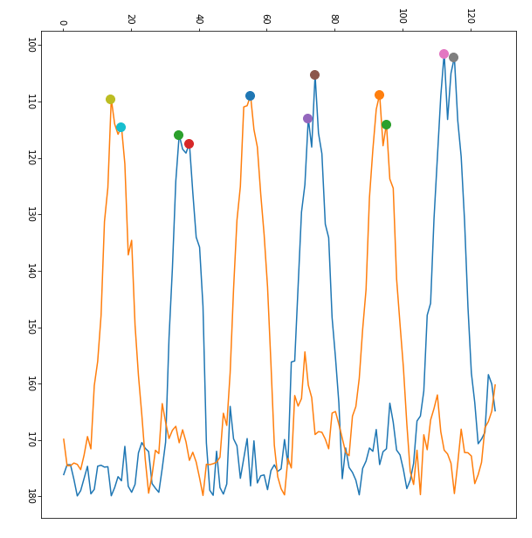
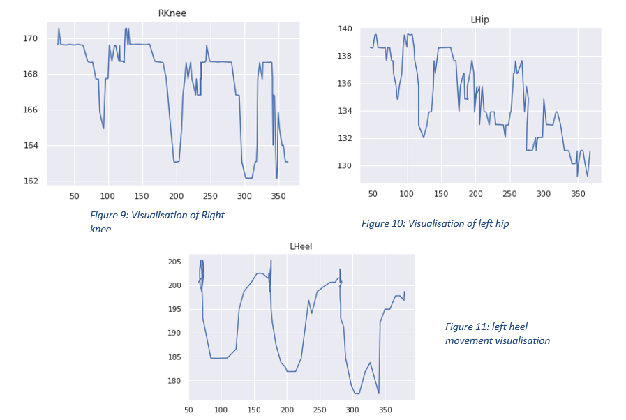
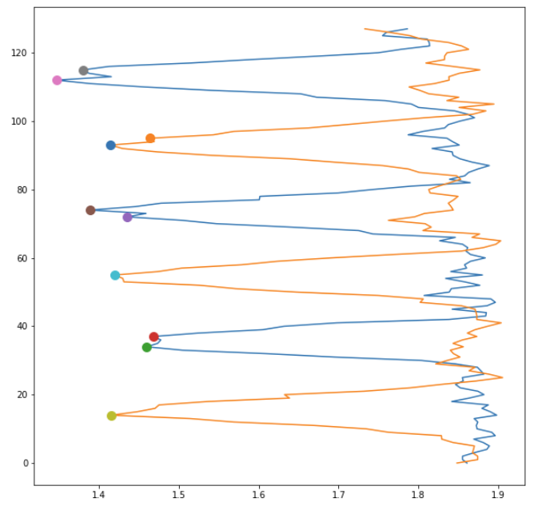

# OpenPose for 2D Gait Analysis: Knee Flexion Landmark Detection 

Gait analysis is the scientific study of walking patterns in the field of biomechanics. It involves analyzing body mechanics, such as joint angles and muscle activity, during the different phases of walking. This analysis helps in diagnosing mobility issues, optimizing athletic performance, and guiding rehabilitation therapies.
It is crucial in various medical fields, especially orthopedics and rehabilitation.  Traditional approaches are not accessible and require costly and obtrusive equipment. 

I designed a markerless, low monetary cost, accessible approach to human gait analysis using an OpenPose-based 2D estimation system for knee flexion landmarks. Next, I plot Clinical gait angles, points of contact, and errors in estimation via approximations in displacement and flexion angles by taking a weighted average tuned to a specific demographic. 
Our approach could aid in the early detection and management of Gait anomalies often linked to people with musculoskeletal disability, providing an accessible diagnosis.

**This work was done under the supervision of Prof. Tathagata Ray, BITS Pilani.**
Contact: [rayt@hyderabad.bits-pilani.ac.in](mailto:rayt@hyderabad.bits-pilani.ac.in)

## OpenPose Installation and Usage Guide 

This README provides detailed instructions for setting up and using OpenPose, an open-source real-time multi-person keypoint detection library for body, face, and hand estimation. The guidelines are based on version 1.7.0 of OpenPose.


## Dependencies for your Installation:
1. **Operating Systems:** 
   - Windows 10
   - Ubuntu 20
   - MacOS Mavericks and above

2. **Requirements:**
   - **CUDA (Nvidia GPU) version:**
     - NVIDIA graphics card with at least 1.6 GB available
     - At least 2.5 GB of free RAM
     - Highly recommended: cuDNN.
   - **OpenCL (AMD GPU) version:**
     - Vega series graphics card
     - At least 2 GB of free RAM memory.
   - **CPU-only (no GPU) version:**
     - Around 8GB of free RAM memory.
   - **General recommendation:**
     - A CPU with at least 8 cores.

## My Installation:
- I Installed OpenPose on a Windows 10 laptop as a portable demo. The system we used has the following specifications:
  - NVIDIA GEFORCE GTX 1650 Ti Graphics card
  - Intel i7 Processor
  - 16 GB RAM
  
  ### Other Dependencies:
  - **CMake GUI version** 
    - Note: OpenCV is installed alongside CMake automatically.
  - **Microsoft Visual Studio 2019 Community Edition**
  - **Compatible CUDA version**
  - **Compatible cuDNN version**

- OpenPose can also be run automatically without installation by using a Jupyter Notebook. This method allows the use of a cloud-based GPU environment like Google Colab, without the need for a local system GPU. The code for video processing in this setup is available [here](https://github.com/janstenum/GaitAnalysis-PoseEstimation/blob/master/OpenPose_JS.ipynb).

- also attempted to install OpenPose from source code on Ubuntu 20.04 but encountered several installation errors with the dependencies.

### Current Status:
- The portable demo installation is successfully working on our Windows system.
-  I was also able to run OpenPose on Google Colab.
- However, both these installations are limited to the utilization of OpenPose. They do not allow for modifications to the OpenPose keypoint detection algorithm or its metrics.(with Flags)
- Hence, I made use of original source code, as shown below documentation, for more comprehensive customization in the usage of OpenPose.

## Downloading Models(Portable python version)

If you don't have the `models` directory:

1. **Clone the OpenPose Repository:**
   - First, clone the OpenPose repository from GitHub to your local machine. Use the following command:
     ```
     git clone https://github.com/CMU-Perceptual-Computing-Lab/openpose.git
     ```
   - This will create an OpenPose directory with all the necessary files, including the `models` directory.

2. **Base Models:**
   - After cloning, navigate to the `models` directory within the OpenPose folder.
   - Double-click on `getBaseModels.bat`. This script will download the required body, face, and hand models.

3. **Optional Models:**
   - For additional models like COCO and MPII, double-click on `models/getCOCO_and_MPII_optional.bat`. Note: These models are slower and less accurate. Download them only if necessary.

## Installation Steps

- Ensure that you have cloned or downloaded the OpenPose repository from GitHub. For detailed instructions, refer to the following resources:
    - OpenPose v1.7.0: [OpenPose GitHub - v1.7.0](https://github.com/CMU-Perceptual-Computing-Lab/openpose/tree/v1.7.0)
    - Documentation: [OpenPose Documentation - v1.7.0](https://github.com/CMU-Perceptual-Computing-Lab/openpose/blob/v1.7.0/doc/)

## Quick Start Guides

1. **Python Quick Start:**
   - For Python usage, refer to both the C++ quick start guide (for the same flags) and the Python testing documentation:
       - [C++ Quick Start Guide](https://github.com/CMU-Perceptual-Computing-Lab/openpose/blob/v1.7.0/doc/quick_start.md)
       - [Python Testing Documentation](https://github.com/CMU-Perceptual-Computing-Lab/openpose/blob/v1.7.0/doc/modules/python_module.md#testing) - Note: Replace "cd build/examples/tutorial_api_python" with "cd python/".
       - The rest of the instructions in `python_module.md` are for the GitHub source code library and can be ignored.

2. **Easy running openpose with Pyton:**
   ```bash
   cd {OpenPose_root_path}
   cd python/
   python openpose_python.py {video_name}
   ```

## Documentation for Source code Installation
- Ensure that you have the dependencies mentioned above satisfied before installation.
    - [OpenPose Guide](https://cmu-perceptual-computing-lab.github.io/openpose/web/html/doc/index.html)


## Open Pose for Gait Analysis


<p align="center">
  
</p>

Anatomical planes of the human body: the sagittal plane divides the body into right and left halves, the frontal (or coronal) plane divides it into anterior (front) and posterior (back) halves, and the transverse plane divides the body into superior (upper) and inferior (lower) halves. These planes are used as points of reference in anatomical and medical contexts to describe locations or movements of various parts of the body.


The work computes gait angles in 2D plane as suggested in Whittle M. W. Gait Analysis: An introduction. Oxford, UK: Butterworth-Heinemann; 1991. [Google Scholar].

## Computed Angles for Gait Analysis

I calculate the following three angles for comprehensive gait analysis:

- **Knee Angle**: Defined as the angle between the femur and the tibia, typically unambiguous. [Sagittal Plane]
- **Ankle Angle**: Commonly defined as the angle between the tibia and an arbitrary line in the foot. While this angle is usually around 90°, it is conventionally set as 0°, with dorsiflexion and plantarflexion being movements in the positive and negative directions, respectively.
- **Hip Angle**: Measured in two distinct ways:
  - The angle between the vertical and the femur. [Sagittal Plane]
  - The angle between the pelvis and the femur, which is the 'true' hip angle, usually defined such that 0° approximates the hip angle in the standing position. [Frontal Plane]

<p align="center">

<!--  -->


<!-- 
<!--  -->
<!--  --> 
</p>

## Single Gait Cycle

The figures illustrates the various positions of the legs during a single gait cycle by the right leg (shown in gray). It depicts stages such as initial contact, loading response, mid-stance, terminal stance, pre-swing, initial swing, mid-swing, and terminal swing, along with heel rise, opposite toe off, and opposite initial contact, demonstrating the sequential movements involved in a complete step.

<!-- 

 -->

<p align="center">
  
</p>


## Running openpose for Gait Analysis.

### 1. Generate JSON Output
For our analysis, I  used 2-D videos captured from a smartphone. We run each input video to produce a json ouput with posing coordinate keypoints for the BODY_25 format as shown below. These corrdinates then go through for analysis of gait. 

<p align="center">
  
</p>

All input test vidoes can be found in the `videos_examples` directory. 

Assuming OpenPose is installed and set up, you can use the following command to generate JSON output from a video:

```bash
openpose.bin --video "input_video.mp4" --write_json "output_json.json"
```

The `output json files` can be found in the `output_jsons` directory. 


### 2. Generate Video Output with Pose Overlay(Real Life)
FT generate a video with pose overlay in real life, including hand and face and leg keypoints, use the following command:

```bash
openpose.bin --video "input_video.mp4" --write_video "output_video_pose_overlay.mp4" --hand --face
```

The `Pose annotated video` can be found in the `video_output_real` directory. 


### 2. Generate Video Output with Pose Overlay(Skeletal)
To generate a video with a black background and pose overlay, showing only keypoints, use the following command:

```bash
openpose.bin --video "input_video.mp4" --write_video "output_video_black_background.mp4" --part_to_show 0 --part_candidates 0

```

The `Pose annotated video` can be found in the `video_output_skell` directory. 


## Real-time analysis from JSON Output 

From the json vector points we perform two analysis:

1. **Knee Flexion  Angle Analysis**
   - At each frame of the input video, we have the x and y coordinates for each key point shown in Posing skeletal structure. I used these      
     coordinates to find the joint angle values corresponding to each frame using cosine inverse angle of vectors. 

   - Left Knee angle: angle between vector (12,13) and vector (13,14)
   - Right Knee angle: angle between vector (9,10) and vector (10,11)

   Next, I ploted the extrimites points for each angle and use K-means clustering to approximate erros in extremes. The visualization is shown below.  

Legend:
x-axis - frame number
y-axis - joint angle value. 
Orange – right knee, and Blue – left knee

<p align="center">
  
</p>


2. **Displacement Analysis**
   - I computed the displacement of each Knee, Hip, and Heel keypoint from the Trasversal Plane to visualize the movement of these points over multiple gait cycles. Multiple cycles for the same video were used  to estimate the errors in displacement analysis. The visualization is shown below.
     

<p align="center">
  
</p>


### Conjunction of Angle and Displacement analysis:

For enhanced performence, we integrate angle and displacment per frame. 

On manual tuning w.r.t Indian population, we found the ideal weights for the normalized weighted summation of each respective displacement and flexion angle per frame. 
The extenisve analysis I performed can be found in the `codes` directory. 
The results of the conjunction of displacement and angle analysis can be found towards the end of `angle_test_for_data_example.ipynb`
Using this, a better approximated final gait analysis is shown below. 


<p align="center">
  
</p>


## Conclusion


I computed the following points of the gait cycle using displacement analysis and joint angle calculation as shown above:
1.	Heel Strike
2.	Foot flat
3.	Mid stance
4.	Heel off
5.	Toe off
6.	Mid swing
7.	Heel Strike (end of cycle)


I was also able to compute the frame number for each of the above points, and correspondingly map it to its UI output.

<p align="center">
  
</p>

To show the accuracy of the proposed gait analysis, we show a correlation with ideal gait cycle. 

<p align="center">
  
</p>


## Ongoing work 

The project involved setting up a camera-based system to gather standardized gait cycle data from Indian users, aiming to develop a synchronized and calibrated multi-view video and motion capture dataset. This normative dataset is crucial for understanding the typical gait characteristics in the Indian population, aiding in various applications like biomechanical research and clinical assessments.

## Future work: 3D Gait Analysis  

Additionally, 3D gait analysis offers  more precise, comprehensive insights into an individual's walking pattern, allowing for a detailed assessment of movement inefficiencies and joint mechanics.By visualizing three-dimensional motion, clinicians and therapists can make more informed decisions, leading to improved patient outcomes and more effective treatment interventions.
Given below are references to further our work to 3D gait analysis:


<p align="center">
  
</p>

link: [Experimental Gait Analysis to Study Stress Distribution of the Human Foot - PMC](https://www.ncbi.nlm.nih.gov/pmc/articles/PMC5694576/)

<p align="center">
  
</p>

<p align="center">
  
</p>


### Potential integration of OpenPose 3D Points and Depth Sensors 

OpenPose offers the capability to track 3D points, although this feature is currently limited to facial features, and left and right hand keypoints. This limitation arises from the complexity involved in accurately capturing and interpreting 3D data.

For those interested in extending the 3D capabilities of OpenPose to full-body tracking, integrating depth sensors presents a viable solution. Depth sensors can provide the additional data necessary for constructing a complete 3D skeleton model.

There are ongoing discussions and developments in the community around this topic. Notable references include:

- [3D skeleton from keypoints - Issue #428 on CMU-Perceptual-Computing-Lab/openpose (GitHub)](https://github.com/CMU-Perceptual-Computing-Lab/openpose/issues/428)
- [3D Reconstruction Demo - jrkwon/openpose (GitHub)](https://github.com/jrkwon/openpose/blob/master/doc/3d_reconstruction_demo.md)

These resources provide insights into current efforts and potential methodologies for integrating depth sensors with OpenPose, paving the way for more comprehensive 3D motion tracking and analysis.


## Acknowledgments and references

The work presented herein was conducted under the  supervision of Prof. Tathagata Ray from the Birla Institute of Science and Technology, Pilani.

1.	Stenum J, Rossi C, Roemmich RT (2021) Two-dimensional video-based analysis of human
gait using pose estimation. PLoS Comput Biol 17(4): e1008935. https://doi.org/10.1371/journal.pcbi.1008935
2.	Viswakumar A, Rajagopalan V, Ray T, Gottipati P and Parimi C (2022) Development of a Robust, Simple, and Affordable Human Gait Analysis System Using Bottom-Up Pose Estimation With a Smartphone Camera. Front. Physiol. 12:784865. doi: 10.3389/fphys.2021.784865
3.	A. Viswakumar, V. Rajagopalan, T. Ray and C. Parimi, "Human Gait Analysis Using OpenPose," 2019 Fifth International Conference on Image Information Processing (ICIIP), 2019, pp. 310-314, doi: 10.1109/ICIIP47207.2019.8985781.
4.	S. Zheng, J. Zhang, K. Huang, R. He, and T. Tan, “Robust View Transformation Model for Gait Recognition,” in International Conference on Image Processing(ICIP), Brussels, Belgium, 2011.[bib] – How to employ Robust PCA with Partial Least Square to address multi-view gait recognition problem?
5.	Majernik, Jaroslav. (2013). Normative Human Gait Databases. Statistics Research Letters. 2. 69-74.
6.	Kwolek, B., Michalczuk, A., Krzeszowski, T., Switonski, A., Josinski, H., Wojciechowski, K.: Calibrated and Synchronized Multi-View Video and Motion Capture Dataset for Evaluation of Gait Recognition, 2019.
7.	OpenPose Documentation. OpenPose: OpenPose Doc - Demo. (n.d.). Retrieved November 7, 2022, from https://cmu-perceptual-computing-lab.github.io/openpose/web/html/doc/md_doc_01_demo.html#running-on-images-video-or-webcam 
8.	Prichep LS. Use of normative databases and statistical methods in demonstrating clinical utility of QEEG: importance and cautions. Clin EEG Neurosci. 2005 Apr;36(2):82-7. doi: 10.1177/155005940503600207. PMID: 15999903.
